# Тестирование интерфейса

Параметры:

* подход к тестированию функционала: "черный ящик"
* тип тестирования: "функиональное" - "исследовательское"
* система управления тесткейсами: github
* система управления проектом: github
* ОС: Windows, версия 11
* браузер: Google Chrome, версия 115.0.5790.110

# Тест-кейсы

## Окно регистрации на сайте [avito.ru](avito.ru) 

### Таблица 1. Успешный процесс авторизации

| № | Шаг |  Изображения шага | Ожидаемый результат | Изображения ожидаемого результата |
| --- | --- | --- | --- | --- |
| 1 | Кликаем на кнопку "Вход " и регистрации" в правом верхнем углу страницы сайта | | Должно появиться окно "Входа" | | 
| 2 |Вход с ипользованием коректно введеной почты в формате <login>@<domain>, например test@test.ru | 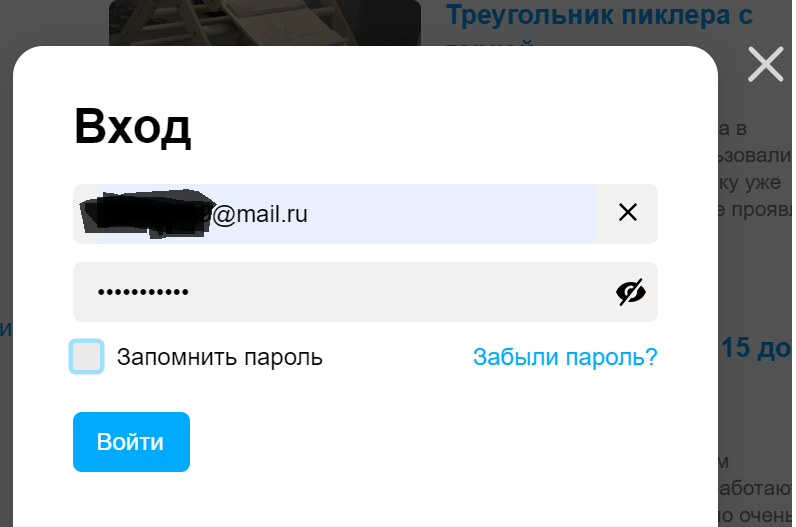 | Успешный вход в систему. Отображение иконки авторизованного пользователя в правом верзнем углу | |
| 3 | Вход с ипользованием коректным номером телефона в формате <+7 1234567890>| 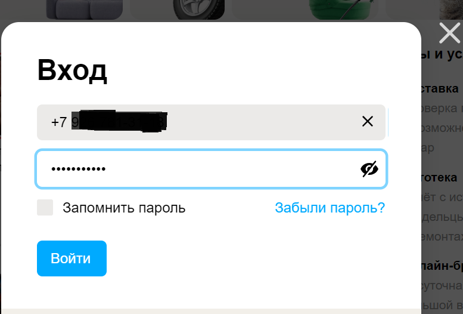 | Успешный вход в систему. Отображение иконки авторизованного пользователя в правом верзнем углу | |

### Таблица 2. Вход в систему с использованием некорректно введеных даных
* по умолчанию использовали шаг 1 из таблицы 1 https://vscode.dev/github/lika2277/test-cases/blob/main/Avito/Login/login-web.md#L20

| № | Шаг |  Изображения шага | Ожидаемый результат | Изображения ожидаемого результата |
| --- | --- | --- | --- | --- |
| 1 | Вход зарегистророванного пользователя с использованием email c некерректно введеным паролем  |  | Выдана ошибка "Неправильный пароль"| 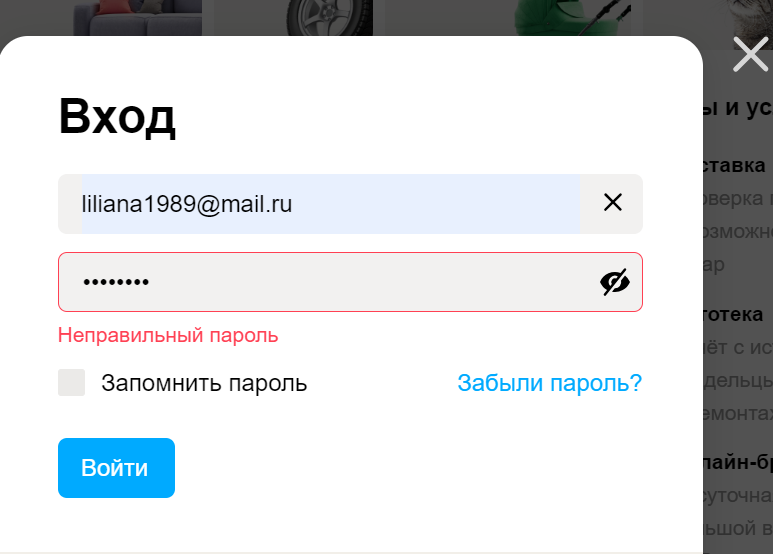 |
| 2 | Вход по email незарегистрированного пользователя: <ntcn@ntcn.he>; <1234566@pp.on> | 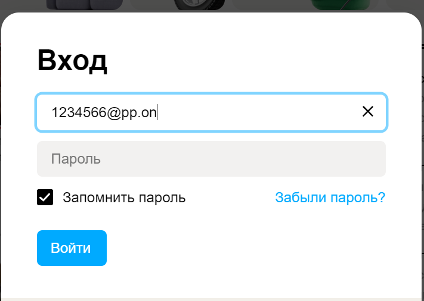 | Должно выйти сообщение об ошибке | 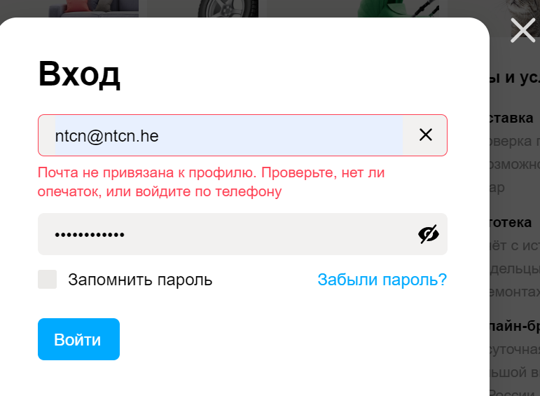 |
| 3 | Вход с невальдным адресом: <bfhbvhf@hdvfdvbgRu>, <123456 @.on>|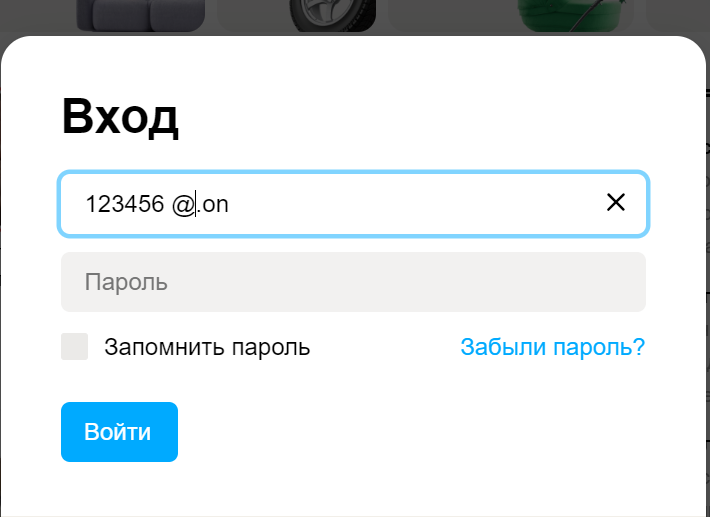 | Должно выйти сообщение об ошибке "Неккоректный email"  | 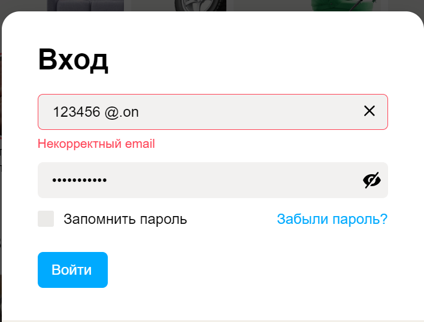|
| 4 | Вход по номеру телефона зарегистророванного пользователя с некерректно введеным паролем |  | Выдана ошибка"Неправильный пароль" |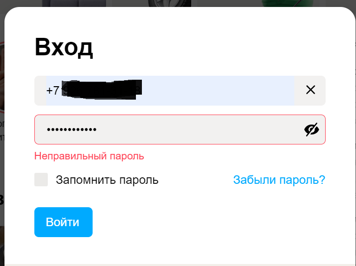|
| 5 | Вход с невальдным номером: <52522627727272772>, <+989898989898> | 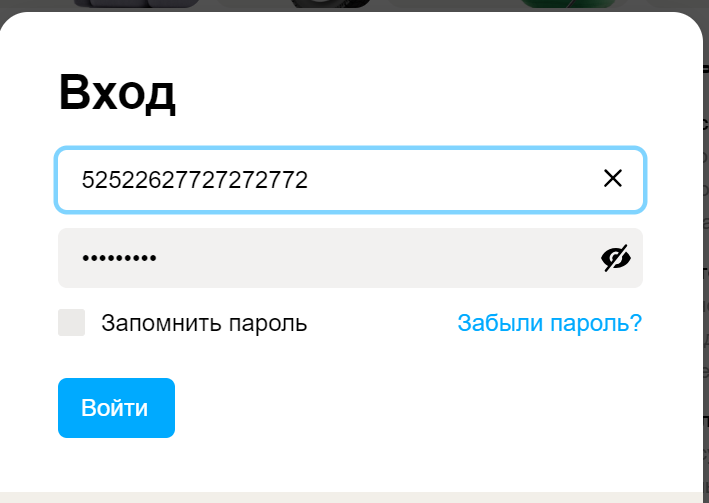 | Сообщение об ошибке "Укажите мобильный телефон"| 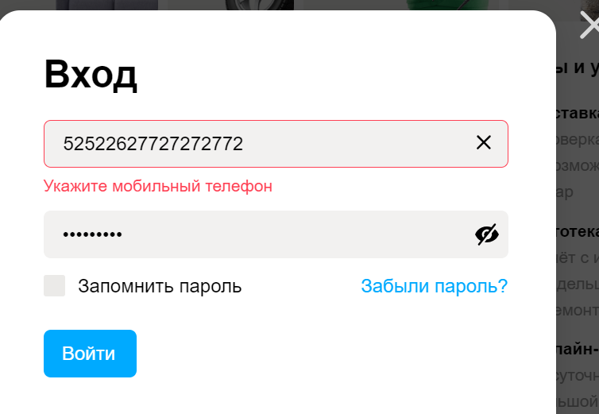 |
| 6 | Вход по email без введеного пароля | --- | Спообщение об ошибке под строкой ввода пароля <Заполните поле> | 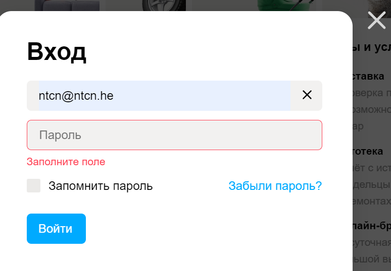 |
| 7 | Ввод по email с применением неправильного пароля более 5 раз | 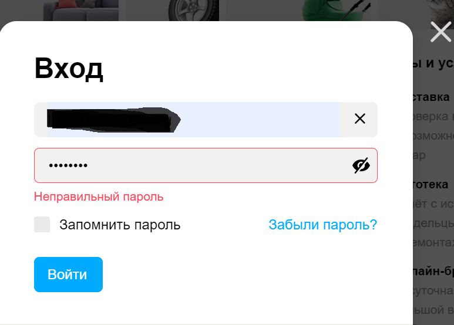| Срабатывает защита профиля. Отправка сообщения на мобильтный номер телефона для дальнейшего входа в систему| 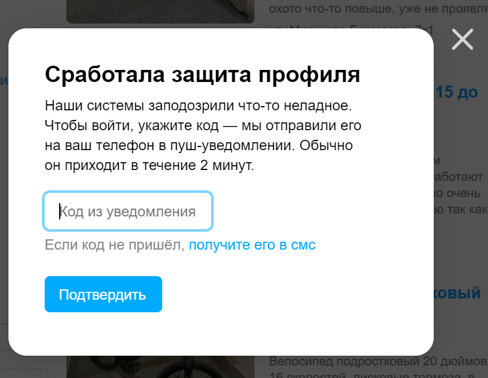 |

### Таблица 3. Кнопка забыли пароль. Вход в систему с использованием кнопки <Забыли пароль?>
* по умолчанию использовали шаг 1 из таблицы 1 https://vscode.dev/github/lika2277/test-cases/blob/main/Avito/Login/login-web.md#L20

| № | Шаг |  Изображения шага | Ожидаемый результат | Изображения ожидаемого результата |
| --- | --- | --- | --- | --- |
| 1 | Открытие окна для воостановление пароля| 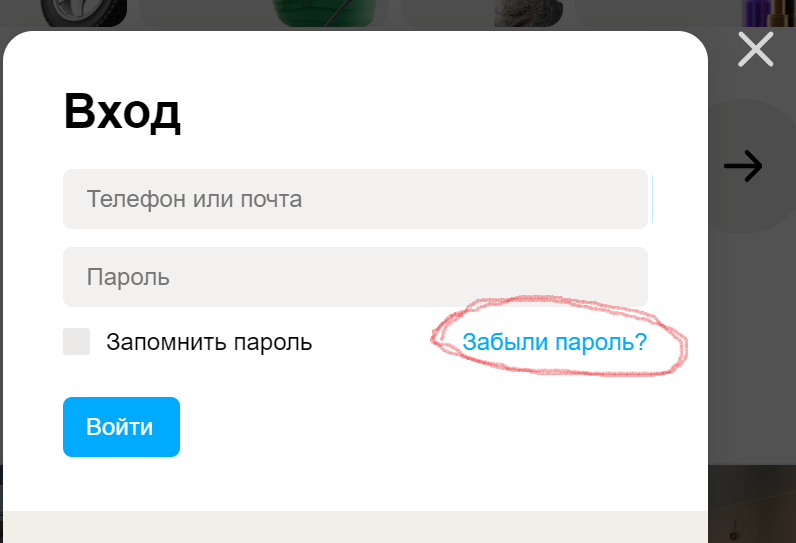 | Открытие окна для восстановление пароля где требуется ввести email или Телефон для сброса текущего пароля в целях задать новый пароль для успешного входа в ситему| 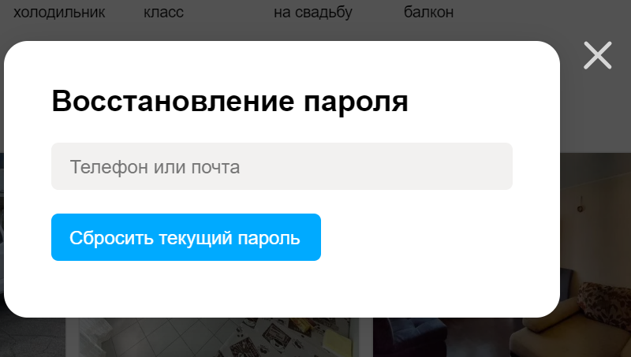|
| 2 | Вводим коректный email для восстановления доступа и нажимаем кнопку <Сбросить текуший пароль>| Смотрим рисунок с таблицы 3, шаг первый <Сбросить текущий пароль> | От AVITO на email придет письмо <Восстановление доступа к профилю>, открыв его нажимаем на кнопку <Придумать пароль> который нужно ввести дважды и нажать кнолпку <Сменить пароль> | 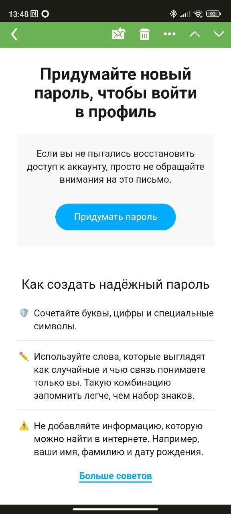 |

### Таблица 4. Использование кнопки <Запомнить пароль>
* по умолчанию использовали шаг 1 из таблицы 1 https://vscode.dev/github/lika2277/test-cases/blob/main/Avito/Login/login-web.md#L20

| № | Шаг |  Изображения шага | Ожидаемый результат | Изображения ожидаемого результата |
| --- | --- | --- | --- | --- |
| 1 | Осуществляем вход выполняя шаг 2 в таблице 1 (https://vscode.dev/github/lika2277/test-cases/blob/main/Avito/Login/login-web.md#L21-L22) используя кнопку <Запомнить пароль> |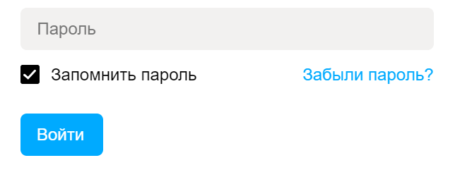| Осуществляется вход без использования повторного входа в личный кабинет при закрытии вкладки Avito и браузера Google Chome используя при этом один и тот же ПК, пока пользователь не осущесвит <Выход> с личного кабинета| 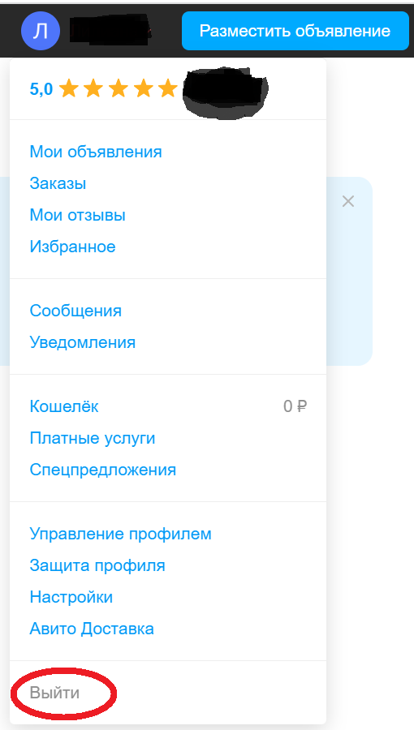 |
| 2 | Осуществляем вход выполняя шаг 2 в таблице 1 (https://vscode.dev/github/lika2277/test-cases/blob/main/Avito/Login/login-web.md#L21-L22) без использования кнопки сохранить пароль|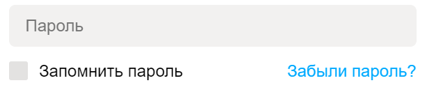 | После закрытия страницы Avito в браузере или закрытие самого браузера Google Chrome пользователь разлогиниться, для входа снова потребуется ввести логин и пароль.| https://vscode.dev/github/lika2277/test-cases/blob/main/Avito/Login/login-web.md#L20 |

# Чек-листы

## Окно регистрации на сайте [avito.ru](avito.ru)

| № | Проверка | Резулььтат | Коментарии |
| --- | --- | --- | --- |
| 1 | Успешный процесс авторизации. Использование корректно введеных данных email и номер телефона. | Passed |  |
| 2 | Вход в систему с использованием некорректно введеных даных: email, телефон, пароль.| Passed |  |
| 3 | Кнопка забыли пароль. Вход в систему с использованием кнопки <Забыли пароль?> | Passed |  |
| 4 | Использование кнопки <Запомнить пароль> | Full | При тестировании кнопки <запомнить пароль>, была выявлена ошибка. При закрытии вкладки avito в браузере и закрытии самого браузера, позьзователь автоматически неразлогинивается, что не является безопасным если пользователь использует гостевой компьютер |

# Баг
## Окно регистрации на сайте avito.ru. Кнопка <Запомнить пароль>

| --- | --- |
| --- | --- |
| Summary | Выявлена ошибка при использовании кнопки <Забыли пароль> | 
| Project | Окно регистрации на сайте [avito.ru](avito.ru) |
| Component | Окно входа в личный кабинет на сайте [avito.ru](avito.ru),  |
| Version | ОС: Windows, версия 11; браузер: Google Chrome, версия 115.0.5790.110 |
| Severity | S3 (Major) |
| Preority | P1 (High) |
| Status| New |
| Author| Бубнова Лилиана |
| Assigned to | Разробочик Avito |
| Description | Окно регистрации на сайте [avito.ru](avito.ru); ОС: Windows, версия 11; браузер: Google Chrome, версия 115.0.5790.110; https://vscode.dev/github/lika2277/test-cases/blob/main/Avito/Login/login-web.md#L51; При тестировании кнопки <запомнить пароль>, была выявлена ошибка. При закрытии вкладки avito в браузере и закрытии самого браузера, позьзователь автоматически неразлогинивается, что не является безопасным если пользователь использует гостевой компьютер |
| Attachment|  |