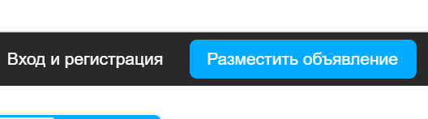
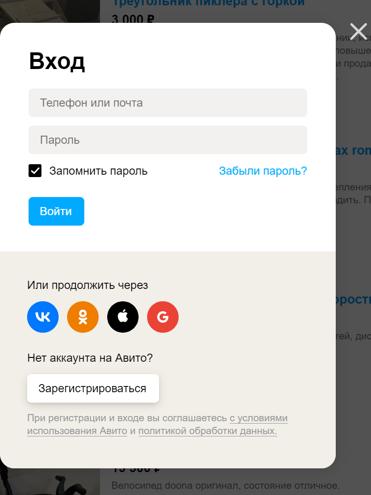

# Тестирование интерфейса

Параметры:

* подход к тестированию функционала: "черный ящик"
* тип тестирования: "функиональное" - "исследовательское"
* система управления тесткейсами: github
* система управления проектом: github
* ОС: Windows, версия 11
* браузер: Google Chrome, версия 115.0.5790.110

# Тест-кейсы

## Окно регистрации на сайте [avito.ru](avito.ru) 

### Таблица 1. Успешный процесс авторизации

| № | Шаг |  Изображения шага | Ожидаемый результат | Изображения ожидаемого результата |
| --- | --- | --- | --- | --- |
| 1 | Кликаем на кнопку "Вход " и регистрации" в правом верхнем углу страницы сайта | | Должно появиться окно "Входа" | | 
| 2 |Вход с ипользованием коректно введеной почты в формате <login>@<domain>, например test@test.ru |  | Успешный вход в систему. Отображение иконки авторизованного пользователя в правом верзнем углу | |
| 3 | Вход с ипользованием коректным номером телефона в формате <+7 1234567890>|  | Успешный вход в систему. Отображение иконки авторизованного пользователя в правом верзнем углу | |